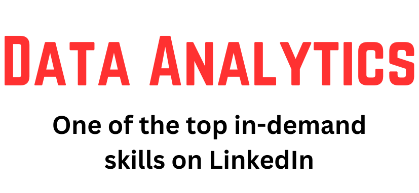
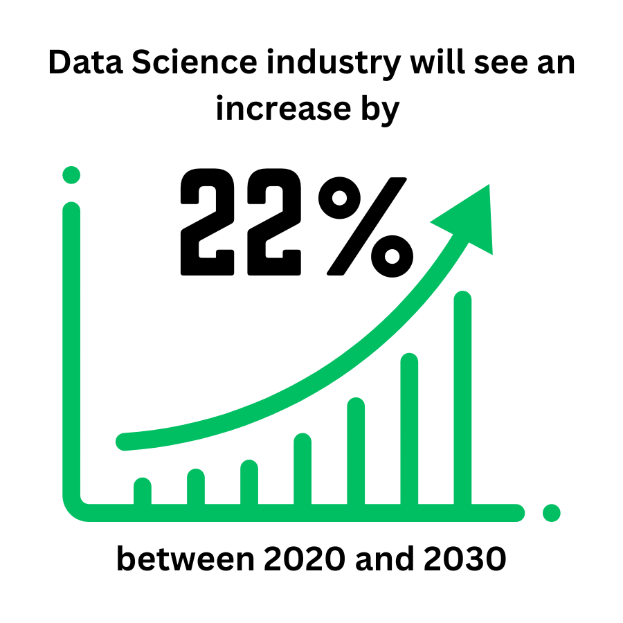
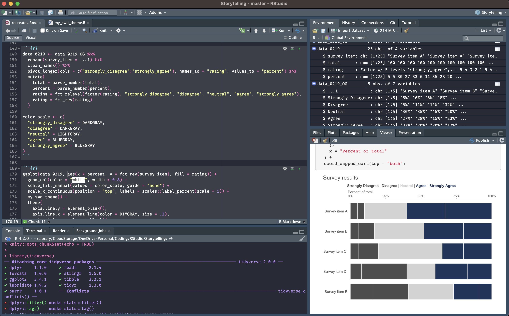
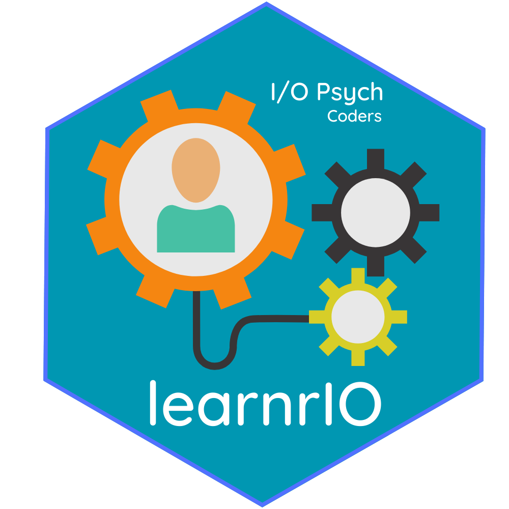
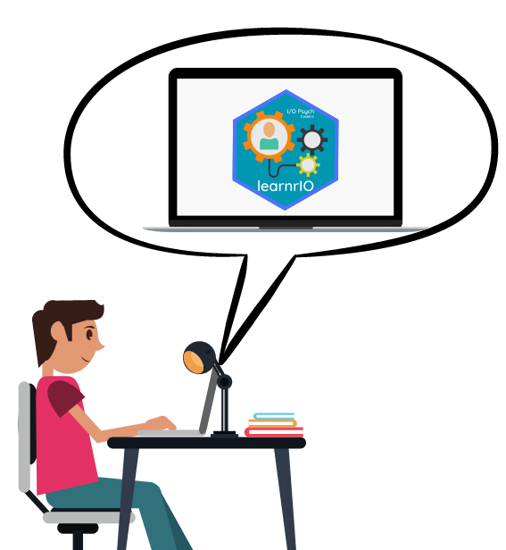
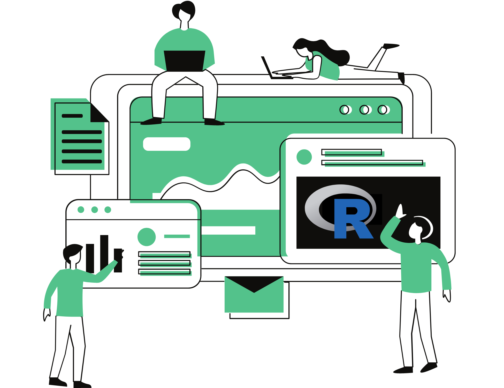

```{r setup, include=FALSE}
knitr::opts_chunk$set(
	echo = TRUE,
	message = FALSE,
	warning = FALSE
)

library(learnr)
library(tidyverse)
library(gradethis)

devtools::load_all()
employee_data <- learnrIO::employee_data 

gradethis::gradethis_setup()
```


## Introduction 

<div> 
  
</div>
<p>

### Problem
In the ever-evolving landscape of modern business, data analytics and programming skills are becoming increasingly crucial for Industrial Organizational (I-O) Psychology professionals.  

<div class="image-column-container">
  
  
  
</div>


We recognize the importance of equipping I-O professionals with the necessary tools they need to excel in the workplace. However, many students lack knowledge of and skills to use data analytics tools most commonly used in applied settings, namely, R, a powerful statistical programming language. While we argue that colleges are the ideal environment to learn R, factors such as the years it can take a professor to get approval to evolve their curriculum, can hinder the ability for schools to meet the skills demand.    

### Solution
To address this growing demand and the academic-workplace skills gap, we have developed an interactive R programming and statistics tutorial specifically tailored for undergraduate and graduate students in the field of I-O Psychology.   


## What is R and Rstudio?
### R Statistical Programming
R is a programming language that was specifically designed for statistical computing and graphics. 

<figure class="float-fig-right"> 
  
</figure>
<p>

R is an open-source language, which means that it's free to use, making it an attractive choice for businesses and users with limited budgets. It has a large community of users who contribute to its development. R is widely used by statisticians, data analysts, and data scientists for tasks such as data manipulation, visualization, modeling, and machine learning.

One of the biggest strengths of R is its extensive collection of packages. Packages are sets of code that provide additional functionality to the R language. There are thousands of packages available for R that cover a wide range of topics, from data manipulation and visualization to machine learning and deep learning. With so many packages available, R users can quickly and easily extend the capabilities of the language to meet their needs.

### Rstudio
<figure> 
  
  <figcaption class="figcap">Rstudio GUI</figcaption>
</figure>
<br>

RStudio is an integrated development environment (IDE) for R that makes it easier to write and organize R code. It provides a user-friendly interface for working with R and has many features that make it a great tool for data analysis and visualization. Some of the features of RStudio include:

- Syntax highlighting, code completion, and smart indentation    
- Visual Markdown Editor  
- Execute R and Python code directly from the source editor  
- Built-in package management tools  
- Integrated help and documentation  
- Interactive debugging  
- Project organization and management  
- Version control integration  
- and much _**MUCH**_ more!

### Things You Can Do with R
Now, let's talk about some of the cool things you can do with R. Here are a few examples:  

- **Data visualization**: R has a wide range of powerful tools for creating data visualizations. With packages like `ggplot2`, you can create beautiful, customizable plots and charts that allow you to explore your data in new ways. You can also create interactive visualizations using packages like `plotly` or `shiny`.  
- **Machine learning**: R has a number of packages for performing machine learning techniques, including classification, regression, and clustering. With packages like `caret` or `mlr`, you can easily build and tune machine learning models, and use them to make predictions on new data.  
- **Text mining**: R has packages like `tm` or `tidytext` that allow you to analyze text data, such as tweets or news articles. You can perform tasks like sentiment analysis, topic modeling, and word frequency analysis.  
- **Web scraping**: With packages like `rvest` or `httr`, you can easily scrape data from websites and use it for analysis. This is a great way to collect data that isn't available through APIs or other sources.  
- **Reproducible research**: R is a great language for doing reproducible research. With tools like `quarto` or `rmarkdown`, you can write reproducible reports and documents that include both your code and your results, making it easy to share your work with others. You can also publish production quality articles, presentations, websites, blogs, and books in HTML, PDF, MS Word, ePub, and more.   

With its large collection of packages and powerful tools for data analysis and visualization, R is a great choice for anyone working with data. RStudio makes it easier to work with R by providing a user-friendly interface and many useful features.  


## Our Vision and Mission
### Vision
Our vision is to empower students pursuing degrees in Industrial and Organizational Psychology with the analytical and statistical skills necessary to excel in the workplace and influence their organizations, their industry, and the field of Industrial and Organizational Psychology.  

### Mission
Our mission is to provide a supplementary interactive course that teaches the basics of R while enhancing the analytical and statistical skills of both undergraduate and graduate students.  

By bridging the academic-workplace skills gap, we aim to equip all students with essential tools necessary to excel in their careers, whatever that looks like: pursuing further education, going into industry, or entering the academy as a professor of psychology or business. We believe that providing a strong foundation in analytical and statistical skills at an early stage will better prepare students for their studies and careers in field of Industrial and Organizational Psychology, as well as better equip them to enter and impact rapidly expanding fields such as People Analytics.  


## The Interactive Course
### **learnrIO**
Through our tutorial, students will have the opportunity to learn basic and more advanced statistical procedures commonly found in applied business settings.  

<figure class="float-fig-right"> 
  
</figure>
<p>

Our tutorial provides a strong foundation in statistical and analytical skills that will better prepare students for future studies or career opportunities in the Industrial Organizational Psychology field.  

Our tutorial is designed to be accessible and easy-to-use for both professors and students. We understand that redesigning course curriculums to incorporate R programming can be challenging. Therefore, we have created an interactive course using the learnr R package that professors can use as a supplement to their existing curriculum. The interactive course includes various modules covering topics such as data manipulation, data visualization, regression analysis, and more. The modules are self-paced, interactive, and include quizzes to reinforce students' understanding of the material.  

### Topics Not Covered


## Benefits
Incorporating our tutorial into existing curriculums has several benefits for both undergraduate and I-O graduate students:  
<br>
- **Easy integration**: Professors can incorporate our tutorial into their existing curriculum without having to overhaul course materials or learn R programming themselves, providing students with an invaluable resource to complement their studies.  
- **Hands-on approach to learning**: Our tutorial provides a hands-on approach to learning statistical and analytical skills that are often difficult to grasp from traditional textbooks or lectures. Students will have the opportunity to engage with the material in a more interactive and immersive way, which can help them retain and apply the knowledge more effectively.  
- **Applicability to real-world scenarios**: Our tutorial is designed to cover real-world applications of statistical and analytical techniques, allowing students to develop a better understanding of how these skills can be applied in their future careers in I-O Psychology.  
- **Better preparedness for graduate school**: Students who learn R programming in undergrad will be better prepared when they enter graduate school, where they may encounter more advanced statistical techniques and require greater data analysis skills. By introducing R programming language early on, students will have a head start in building a strong foundation in data analysis, making it easier for them to acquire more advanced skills in the future.  
- **Enhanced employability and opportunities**: Learning R programming language can enhance students' employability and open up opportunities in a range of fields beyond academia. Employers across various industries are increasingly seeking candidates with strong data analytical skills and knowledge of programming languages like R, which are becoming essential tools in the workplace.  
- **Demonstrates professors' commitment**: By incorporating our tutorial into their curriculums, professors can demonstrate their commitment to equipping students with the skills they need to succeed in their future careers. This can help attract and retain students who are looking for a comprehensive and practical approach to learning statistical and analytical skills.


## Tutorial Preview

In this exercise, the learner is asked to use `dplyr` and `tidyr` to perform three transformations on the fictional employee dataset. They are asked to filter for employees in the Marketing department, group by department and calculate the average salary, and pivot the data to have the department as rows and start_date as columns. The exercise code block includes the necessary code to load the dataset and perform the transformations, as well as print the results for the learner to check their work.  


### Demonstrates executing a code block exercise. 
*Click "Run Code" to view the first 5 rows of the dataset:*
```{r view, exercise=TRUE}
head(employee_data)
```


### Demonstrates a partially completed exercise for which a student must fill in the correct answer.  
*Fill in the blank to group by department and calculate the average salary:*
```{r group, exercise=TRUE, exercise.blanks = "___"}
employee_data |> 
  ___(___) |> 
  ___(avg_salary = mean(salary))
```

```{r group-solution, exercise.reveal_solution = FALSE}
employee_data |> 
  group_by(department) |> 
  summarize(avg_salary = mean(salary))
```

<!-- I used grade_this() instead of grade_this_code(). grade_this_code() flagged answer incorrect if I typed `summarise` instead of `summarize`. That's because grade_this_code() passes if the result and solution code string outputs are an exact match. With grade_this(), the .result and .solution objects contain the RESULT. So, the student passes if the user's result from the code output is the same as the solution result (I could also use pass_if_equal() which automatically passes if .result is equal to .solution -->
```{r group-check}
# grade_this_code()
grade_this({
  if (identical(.result, .solution)) {
    pass()
  }
  fail()
})
```


### Demonstrates completing an exercise from scratch.  
*Pivot the data to have the department as rows and start_date as columns. Save the result in a variable called `dept_start_date_pivot`. Print the variable:*
```{r pivot, exercise=TRUE, exercise.blanks = "___"}

```

```{r pivot-solution, exercise.reveal_solution = FALSE}
dept_start_date_pivot <- employee_data |> 
  select(department, start_date) |> 
  pivot_wider(names_from = start_date, values_from = department)

dept_start_date_pivot
```

```{r pivot-hint-1}
dept_start_date_pivot <- employee_data |> 
  ___(___, ___) |> 
  ___(___ = ___, ___ = ___)

dept_start_date_pivot
```

```{r pivot-hint-2}
dept_start_date_pivot <- employee_data |> 
  select(___, ___) |> 
  pivot_wider(names_from = ___, values_from = ___)

dept_start_date_pivot
```


```{r pivot-check}
grade_this({
  if (identical(.result, .solution)) {
    pass()
  }
  fail()
})
```


## Addressing the Challenges Faced by Professors
<figure class="float-fig-right"> 
  
</figure>
<p>
We understand that incorporating R programming into the curriculum can be a daunting task for professors who may not have experience with this language or the necessary resources available. Our tutorial provides a solution to this challenge that enables professors to integrate R programming into their courses without any prior knowledge or expertise.  

<figure class="float-fig-left"> 
  
</figure>
<p>

### learnrIO Can Help
By using our interactive R programming and statistics tutorial as a supplemental course material, professors can confidently provide their I-O Psychology students with the skills and knowledge they need to excel in their careers. This not only benefits the students but also enhances the overall reputation and effectiveness of I-O Psychology programs, ensuring that graduates are well-equipped to meet the demands of the modern business world.


## Conclusion

<div style="display: flex; flex-wrap: wrap; justify-content: space-around"> 
  <div>
  <p style=" text-align: left"> 
    We believe that our tutorial is a valuable resource for both undergraduate and graduate students in the Industrial Organizational Psychology field. We invite professors to explore our tutorial and consider incorporating it into their curriculum to enhance their students' statistical and analytical skills. 
  </p>
  </div>
  
  <div> </div>
</div>
<p>


As data-driven decision-making continues to shape the future of business, our tutorial is a powerful tool that can help prepare the next generation of I-O professionals to make a meaningful impact in their organizations.


